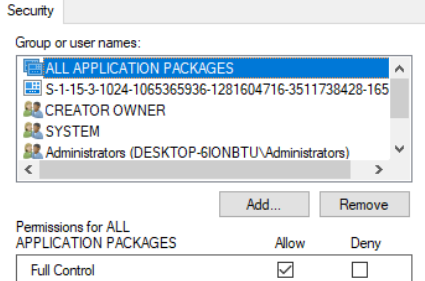

# MetaData & INIFile Test Automated

## Requirements:
  1. [Python](https://www.python.org/downloads/)
  
  2. Python Modules
      ```bash
      pip install pywin32-ctypes
      pip install pywin32
      ```

## System Compatibility Requirements
  1. Registry Permissions:
  
      - Navigate to these path in Registry
        ```bash
        Computer\HKEY_LOCAL_MACHINE\SOFTWARE\ODBC
        Computer\HKEY_LOCAL_MACHINE\SOFTWARE\ODBC\ODBC.INI
        Computer\HKEY_LOCAL_MACHINE\SOFTWARE\ODBC\ODBCINST.INI
        ```
      Perform below mentioned steps for all the Registry folders given above.
      - Go to Permissions by right clicking on them
      - Allow `Full Control` for the current user & ALL APPLICATION PACKAGES
        

## Input:
  1. `Username`       - Simba/MagSW Username
  2. `Password`       - Simba/MagSW Password
  3. `BasePath`       - Current Working Directory Path (aspecially required to execute on Azure)
  4. `InputFileName`  - Name of Input File. i.e input.json (Extension must be .json)
        - Find more details about InputFile below
            1. `SourcePath` - Source Path of the package. Make sure to Map a network drive 
               and use it in the Virtual Machine if end execution would happen on a Virtual machine via Azure.  
               Refer this to [Map Network Drive](https://magnitudesoftware-my.sharepoint.com/:v:/g/personal/cjoshi_magsw_com/EZkVdUiiKNJKlORQQnR78vsBngNCkAEERs1YEBN3NqA_xw)
            2. `DestPath` - Path to extract the Package. It's advisable not to set it on Desktop due to permission issue while executing in a Virtual Machine via Azure
            3. `ForceUpdate` - Set true to download the Package even if it's present on the `DestPath` else false
            4. `Branch` - Branch of Core
            5. `Brand` - Plugin's Brand
            6. `WaitForUserToSetupDSN` - Set true to manually set up the Data Source Configurations. **Do not set it to true while running from Azure.** It would surely fail as Azure does not work in interactive environment.
            7. `DataSourceConfiguration` - Data Source Configuration in key value pair
     

## Usage
- To Perform MetaData Test
     ```bash
     python MetaTestRunner.py username password C:fakepath input.json
     ```
- To Perform INI File Test
     ```bash
     python INIFileTestRunner.py username password C:fakepath input.json
     ```
  